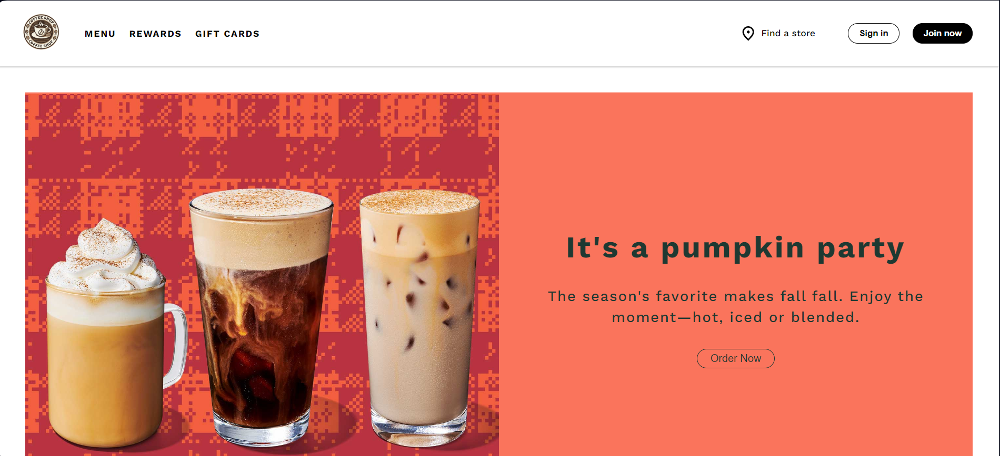
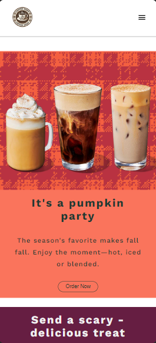

# Coffee Shop Website
A modern and responsive coffee shop website built using HTML, CSS, and JavaScript.

## About
The website features a homepage and a sign in page. The homepage includes a header, a product showcase, and a footer. On smaller screens, the header titles transform into a hamburger menu, which opens a sidebar when clicked. The sign in page contains a registration screen and a footer. Both pages are fully optimized for mobile devices.

## Screenshots
### Homepage

### Menu and Sidebar

### Sign in Page

### Mobile Devices

  
  

## License
This project is licensed under the MIT License - see the [LICENSE](LICENSE) file for details.
